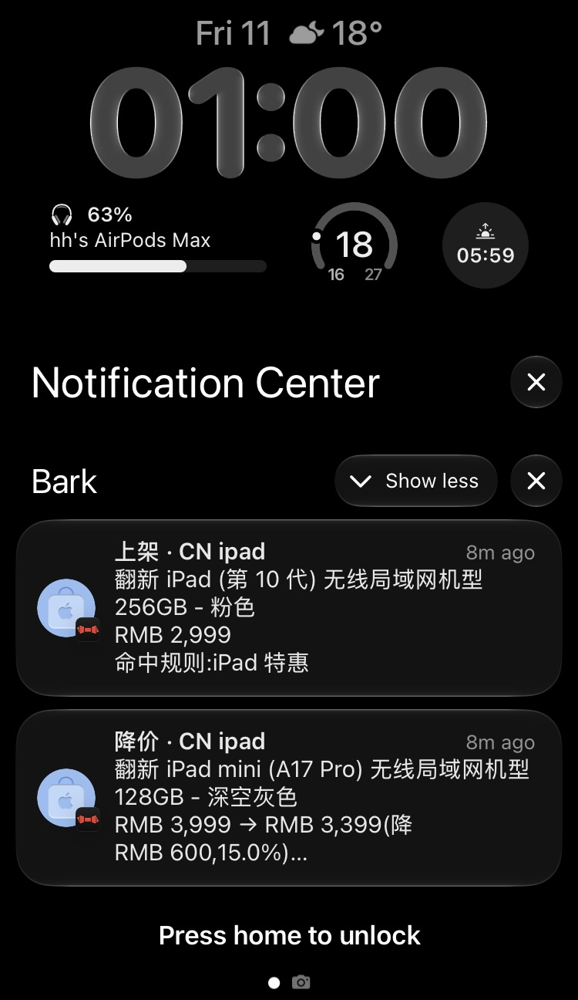
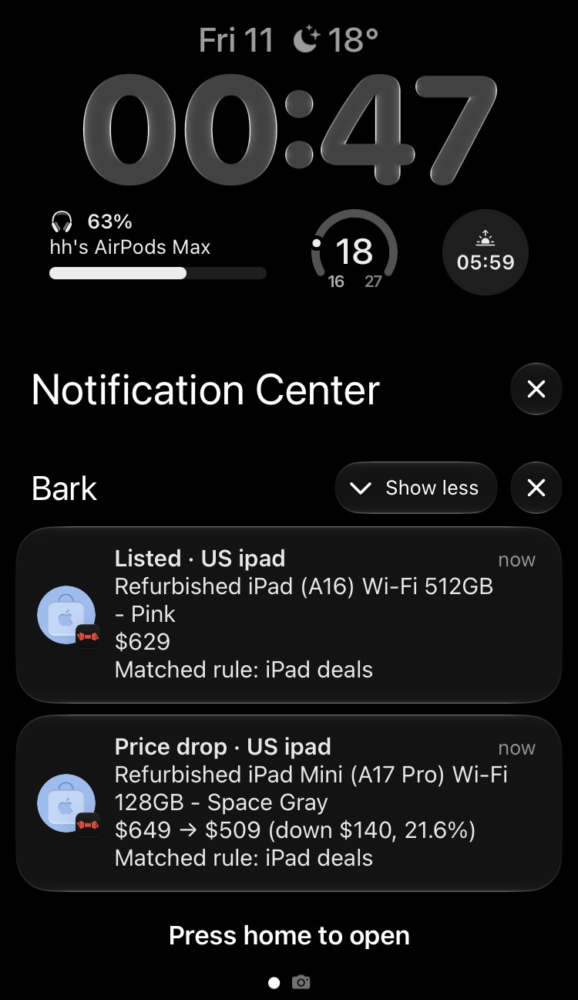

# refurb-sentry

[English](README.md) · **简体中文**

[](https://github.com/hh-io/refurb-sentry/actions/workflows/ci.yml)
[](https://github.com/hh-io/refurb-sentry/releases/latest)
[](https://goreportcard.com/report/github.com/hh-io/refurb-sentry)
[](LICENSE)

监控 Apple 官网**官方翻新产品**（Apple Certified Refurbished）的上架、降价与下架变动，按多维硬件规格精准过滤后推送到 Bark、Telegram、飞书、企业微信、钉钉等渠道。

单个静态二进制，守护进程常驻运行，状态原子落地为单个 JSON 文件，重启不丢记录。

<p align="center">
  
  &nbsp;&nbsp;&nbsp;&nbsp;
  
</p>

> [!NOTE]
> 推送通知文本支持中文（`notify.lang: zh-CN`，默认）与英文（`en`）。日志与错误信息始终保持中文（面向运维与排错）。商品标题语言由抓取的 Apple 商店决定（如美区推送英文标题，国区推送中文标题）。

---

## 目录

- [核心特性](#核心特性)
- [快速开始](#快速开始)
- [推送预览](#推送预览)
- [监控范围](#监控范围)
- [过滤规则配置](#过滤规则配置)
- [推送渠道配置](#推送渠道配置)
- [配置与网络](#配置与网络)
- [生产部署](#生产部署)
- [状态与可靠性设计](#状态与可靠性设计)
- [开发](#开发)
- [免责声明](#免责声明)
- [许可证](#许可证)

---

## 核心特性

- ⚡️ **准实时监测**：精准捕捉新上架、降价、下架 3 类事件；默认 120 秒轮询一次，这是 Apple 边缘 CDN 缓存 TTL 决定的物理下限，详见[请求频率](#请求频率与-cdn-缓存原理)。
- 🎯 **多维精准过滤**：支持按机型、芯片（M2/M3/M4 Pro/Max 等）、CPU/GPU 核心数、内存、存储容量、颜色、发布年份及价格区间组合筛选。
- 📱 **丰富推送渠道**：原生支持 Bark 与通用 Webhook（开箱对接 Telegram、飞书、企业微信、钉钉、Server 酱及 Discord 等）；提供批量合并摘要，防新品刷屏。
- 🌍 **全球 19 地区覆盖**：支持中国大陆、中国香港、中国台湾、美、日、英、德等 19 个国家和地区的翻新商店，完整清单见[监控范围](#监控范围)。
- 🛡️ **轻量且可靠**：Go 单静态二进制，无数据库依赖，状态即单个 JSON 文件，容器镜像约 17MB；具备**首轮静默建基线**、**抓取失败绝不误判下架**与**未送达整轮回滚**机制。

### 它不做什么（边界明确）

- **无库存剩余数量**：官方数据源仅代表“在架 = 可买”，不提供具体库存台数。
- **不做历史价格走势图**：本地状态仅保留当前最新价以判断降价事件。
- **不做反爬虫对抗**：公开静态页面命中边缘 CDN，无风控，无需代理池与指纹伪装。
- **不做自动下单/抢购**：仅用于监控推送，不接受自动化购买相关功能请求。

---

## 快速开始

### 1. 安装

#### macOS（推荐 Homebrew）

```bash
brew install --cask hh-io/tap/refurb-sentry
```

后续通过 `brew upgrade --cask refurb-sentry` 更新。二进制无 Apple 签名，cask 安装时会自动移除隔离属性（quarantine），避免被 Gatekeeper 拦截。

#### Linux / VPS（预编译二进制）

前往 [Releases 页面](https://github.com/hh-io/refurb-sentry/releases/latest) 下载对应平台（支持 Linux/macOS 的 amd64、arm64、armv7）的 tar 包，解压即用（内含二进制、示例配置与 systemd/launchd 文件）：

```bash
tar xzf refurb-sentry_*_linux_amd64.tar.gz
```

#### Docker

若不想在本机安装运行时，可直接运行容器镜像：`ghcr.io/hh-io/refurb-sentry`（详见 [生产部署 → Docker](#docker-compose)）。

<details>
<summary>源码编译安装（需 Go 1.26+）</summary>

```bash
go install github.com/hh-io/refurb-sentry/cmd/refurb-sentry@latest

# 或克隆仓库构建（附带示例配置文件）
git clone https://github.com/hh-io/refurb-sentry && cd refurb-sentry
go build -o refurb-sentry ./cmd/refurb-sentry
```
</details>

---

### 2. 配置与运行（三步上手）

```bash
# 1. 创建本地配置并配置你的推送凭证（以 Bark 为例）
cp configs/config.example.yaml configs/config.yaml
export BARK_KEY=your_bark_device_key

# 2. 查询当前地区和分类可用的过滤维度与真实在售值
./refurb-sentry -config configs/config.yaml -list-dims
# 初次写规则时加 -skeleton，额外得到一段可直接粘贴的规则骨架
./refurb-sentry -config configs/config.yaml -list-dims -skeleton

# 3. 试运行一轮：在终端打印当前抓取与通知结果（不写状态文件、不触发实际推送）
./refurb-sentry -config configs/config.yaml -once -dry-run

# 4. 确认无误后正式常驻运行
./refurb-sentry -config configs/config.yaml
```

> [!TIP]
> `configs/config.example.yaml` 是一份十来行的**最小配置**：只写必填项，其余全部走内置默认值（轮询 120 秒、状态存 `data/state.json`、中文推送文案等）。需要代理、多地区、其它推送渠道或更细的 HTTP 调优时，再去 `configs/config.full.yaml` 抄对应片段——那份列出了每一个可配项及其取舍来由。

> [!IMPORTANT]
> **首次运行只会静默建立商品基线，绝不推送任何通知**。这样可防止在架的数百款历史商品一次性轰炸手机。从第二轮轮询起，发生的新增、降价或下架才会推送。

---

### 3. 命令行参数

| 参数 | 说明 |
|---|---|
| `-config` | 配置文件路径，默认 `configs/config.yaml` |
| `-once` | 仅执行单轮抓取与比对后退出 |
| `-dry-run` | 试运行模式：不实际推送、不写入状态文件，将通知打印到终端 |
| `-list-dims` | 查询目标地区/分类在 Apple 商店当前在售商品的所有维度及取值 |
| `-skeleton` | 配合 `-list-dims`，额外打印可直接粘贴到 `rules:` 下的规则骨架；单独给出时隐含 `-list-dims` |
| `-version` | 打印当前版本号 |

---

## 推送预览

### 单条降价通知

```text
降价 · CN mac
翻新 14 英寸 MacBook Pro Apple M4 Pro 芯片 (配备 12 核中央处理器和 16 核图形处理器)
RMB 14,999 → RMB 13,499（降 RMB 1,500，10.0%）
命中规则：MacBook Pro 高配
https://www.apple.com.cn/shop/product/...
```

### 批量合并摘要（当单轮事件数超过 `notify.digest_threshold` 时自动触发，默认 5）

```text
翻新监控 · 上架 6 / 降价 2
[上架] CN 翻新 Mac mini Apple M4 芯片 RMB 4,699
[降价] CN 翻新 14 英寸 MacBook Pro RMB 14,999 → RMB 13,499
……
```


### 每日汇总（**默认开启**，每天 09:00；`notify.daily_summary: ""` 关闭）

```text
翻新监控日报 · 2026-09-12
CN/mac 在架 206（+8 / -4），命中规则 1
CN/watch 在架 28（+0 / -0），命中规则 0

自上次汇总以来：上架 8，降价 2，下架 4；已推送 1 条
上次汇总 09-11 09:00
```

> [!TIP]
> 日报的用途不是“多一条推送”，而是**把“手机很安静”这个二义信号变成单义**：日报到了，说明抓取与推送链路都通；日报没到，就是系统出了问题。此前“进程挂了”与“最近确实没新品”在体感上完全一样。
>
> 其中的**命中规则数**还能暴露规则写错——维度键名抄错、型号猜错（如 `refurbClearModel: [watchultra4]` 猜错了实际命名）都不会有任何报错，表现只是这个数字长期为 0。
>
> 某个地区分类连着三轮没抓到时，日报会在那一行标出 `（数据陈旧，最后更新 …）`。抓取失败的范围会被跳过，商品原样留在状态里——不标出来的话，它看起来和“一切正常但没有变动”一模一样，等于在范围粒度上把刚消除的二义又放了回来。
>
> 它**默认开启**，因为这个工具的常态是配一条窄规则等上几个月：期间“手机安静”既可能是没货，也可能是进程挂了、或规则写错了永远不会命中，而三者需要的行动完全不同。不想要就关掉：`notify.daily_summary: ""`，或只留键不写值（`daily_summary:`）；不想动配置文件就用环境变量 `REFURB_DAILY_SUMMARY=`——Docker 下要写进 compose 的 `environment:` 段，只写在 `deploy/.env` 里不会进到容器中。
>
> 它不产生任何额外抓取，只把已有状态读一遍，当天只发一份。新部署起来后**不等到点立刻发一份**（08:00 装好、配的 09:00 也会马上收到），这是“装好了确实在跑”的确认，也让你第一眼就看到规则当前命中几件；当天到点时不会再发第二份。
>
> **时区取自进程的 `TZ` 环境变量，没有设置时用服务器的系统时区**——配置文件里没有这一项。
> - **Docker**：`deploy/docker-compose.yml` 已默认 `TZ: ${TZ:-Asia/Shanghai}`，要改就在 `deploy/.env` 里写 `TZ=Europe/Berlin`（镜像内置 tzdata，填 IANA 名称即可）。
> - **systemd / launchd**：跟随服务器的系统时区（`/etc/localtime`）。**云主机默认往往是 UTC**，那时配 `09:00` 会在北京时间 17:00 才送达。用 `timedatectl set-timezone Asia/Shanghai` 改掉，或在 unit 的 `EnvironmentFile` 里加一行 `TZ=Asia/Shanghai`。

---

## 监控范围

- **19 个地区**：`AU` `BE` `CA` `CH` `CN` `DE` `ES` `FR` `HK` `IE` `IT` `JP` `KR` `NL` `NZ` `SG` `TW` `UK` `US`
- **8 个分类**：`mac` `ipad` `iphone` `watch` `airpods` `appletv` `homepod` `accessories`

> [!NOTE]
> **地区 × 分类矩阵是稀疏的**（部分组合在 Apple 官网不存在）：
> - `CN`、`HK` 无 `iphone` 与 `appletv` 分类，请求直接返回 404；
> - `US` 的 `appletv`、`airpods`、`homepod` 页面返回 200，但无商品数据。
>
> 首次启动会对配置的组合做预检校验，不可用的组合会明确报错退出，绝不留下残缺基线。实测 `MX` 与 `IN` 暂无官方翻新店。

---

## 过滤规则配置

### 1. 查询当前分类的实际可用维度

不同分类在 Apple 商店呈现的维度各不相同（例如 Mac 有内存/存储容量，Watch 有表壳尺寸/材质），编写规则前建议先运行查询：

```console
$ ./refurb-sentry -config configs/config.yaml -list-dims -skeleton

===== CN/mac(208 件)=====
  refurbClearModel       (机型)   display, imac, macbookair, macbookneo, macbookpro, macmini, macstudio
  dimensionScreensize    (尺寸)   13inch, 14inch, 15inch, 16inch, 24inch, 27inch
  dimensionRelYear       (发布年份) 2022, 2024, 2025, 2026
  dimensionColor         (外观)   blue, midnight, silver, space_gray, spaceblack, starlight, ...
  tsMemorySize           (内存)   128gb, 16gb, 24gb, 32gb, 36gb, 48gb, 64gb, 8gb
  dimensionCapacity      (容量)   1tb, 256gb, 2tb, 4tb, 512gb, 8tb
  chips                  (芯片)   A18 Pro, M2, M4, M4 Max, M4 Pro, M5, M5 Max, M5 Pro

  ----- 规则骨架(整段复制到配置的 rules: 下,再删掉不要的取值)-----
  - name: CN mac
    regions: [CN]
    categories: [mac]
    dimensions:
      refurbClearModel: [display, imac, macbookair, macbookneo, macbookpro, macmini, macstudio]
      dimensionScreensize: [13inch, 14inch, 15inch, 16inch, 24inch, 27inch]
      dimensionRelYear: [2022, 2024, 2025, 2026]
      dimensionColor: [blue, midnight, silver, space_gray, spaceblack, starlight]
      tsMemorySize: [128gb, 16gb, 24gb, 32gb, 36gb, 48gb, 64gb, 8gb]
      dimensionCapacity: [1tb, 256gb, 2tb, 4tb, 512gb, 8tb]
    chips: [A18 Pro, M2, M4, M4 Max, M4 Pro, M5, M5 Max, M5 Pro]
```

括号里的标签直接取自 Apple 商店页面，因此**会随地区语言变化**（抓美区就是 `(Models)`、
`(Memory)`）；只有 `chips` 是本工具自己算出来的，标签恒为 `芯片`，表头的 `件` 同理——
那属于面向运维的终端输出。括号两侧的键与取值是稳定标识符，写规则时用的正是它们。

加上 `-skeleton` 后，表格下面会多出一段**可直接粘贴的规则骨架**，键名与取值都是该地区/分类
当前实际在售的值，整段复制到配置的 `rules:` 下即可开始改。它列出全部取值时等价于「不过滤」，
**要做的是删减而不是补全**——删到只剩你想要的那几个取值，规则才开始起作用。
当前无货的维度不会进骨架：写进规则等于加了一个永不匹配的条件。

骨架只列有真实取值的字段。`min_cpu_cores`、`max_price` 这些没有可枚举取值的条件不会出现在
骨架里——往一整段实测值中间塞一个凭空的数字，读者会以为它也是从数据里来的。
这些字段见下面的[规则字段速查](#3-规则字段速查)，需要时自己加。

日常只是想看「现在有哪些取值」或排查芯片解析时，不加 `-skeleton` 即可，输出会干净很多。

### 2. 规则编写示例

在 `configs/config.yaml` 的 `rules` 节点添加规则：

```yaml
rules:
  - name: MacBook Pro 高配捡漏
    regions: [CN]
    categories: [mac]
    dimensions:
      refurbClearModel: [macbookpro]
      tsMemorySize: [24gb, 36gb, 48gb]
      dimensionCapacity: [1tb, 2tb]
    chips: [M4 Pro, M4 Max, M5 Pro, M5 Max]
    min_cpu_cores: 12
    max_price: 20000

  - name: Mac mini 入门性价比
    regions: [CN]
    categories: [mac]
    dimensions:
      refurbClearModel: [macmini]
    max_price: 6000
```

### 3. 规则字段速查

| 字段 | 类型 | 说明 |
|---|---|---|
| `name` | string | 规则备注，会展示在推送的“命中规则”中；留空默认为 `rule#N` |
| `regions` | list | 限定地区代码列表；留空表示不限制地区 |
| `categories` | list | 限定分类列表；留空表示不限制分类 |
| `dimensions` | map | 结构化页面维度（键因分类而异，以 `-list-dims` 输出为准） |
| `chips` | list | 芯片型号（如 `M4 Pro`），从标题中智能解析 |
| `min_cpu_cores` | int | 最低 CPU 核心数，从标题中智能解析 |
| `min_gpu_cores` | int | 最低 GPU 核心数，从标题中智能解析 |
| `title_match` | regex | 正则匹配**归一化后**的标题（自动兼容各类连字符与空格） |
| `min_price` | number | 价格下限（含），`0` 表示不限 |
| `max_price` | number | 价格上限（含），`0` 表示不限 |

**匹配逻辑**：
- 规则之间为 **OR**（命中任意一条规则即发送推送）；
- 规则内各字段之间为 **AND**；
- 同一字段内多个候选值为 **OR**；留空字段不做限制；英文字符匹配大小写不敏感。
- **从严匹配机制**：商品缺少规则指定的某项维度时判定为不匹配；核心数未能解析出数字时不满足任何 `min_*_cores`。宁可漏推，不把未知项误推。
- 规则仅在**推送环节**触发过滤；底层状态库始终全量追踪所有在售商品。放宽规则时，早已在架的商品不会被当成新上架。

### 4. 芯片与核心数解析排错

机型、内存、容量等属于页面的结构化字段，相对可靠（例外见下一节）。而**芯片型号与 CPU/GPU 核心数仅存在于标题文本中**，且各语种语序差异极大：

```text
US  Refurbished 14-inch MacBook Pro Apple M5 Pro chip with 12-Core CPU and 16-Core GPU
FR  Mac mini reconditionné avec puce Apple M4, CPU 10 cœurs, GPU 10 cœurs
JP  14インチMacBook Pro [整備済製品] 10コアCPUと10コアGPUを搭載したApple M5チップ
```

解析器**不按地区分派正则**，而是把芯片「指示词」与「型号」解耦并同时认两种语序，
因此新增地区通常不必改解析器。在 19 个地区 2000+ 在售商品上实测：**芯片 100%、
核心数 95%**（其余 5% 是官方标题本身就没写核心数）。

Apple 还会在**同一个页面里混用**普通空格、不间断空格（U+00A0）与多种 Unicode 连字符
（U+2011、U+2014）——西班牙/意大利/法国站用 U+00A0 分隔 `M4 Pro`，而同页其它机型
用的是普通空格。因此标题会先归一化再匹配，`title_match` 也是跑在归一化后的文本上，
正则里写普通的半角空格与连字符即可。

即便如此，Apple 改文案仍可能打破解析。解析失败时商品照常被追踪（芯片记为未知），
但用到 `chips`、`min_cpu_cores`、`min_gpu_cores` 的规则会跳过它。若发现漏推，
运行 `./refurb-sentry -config configs/config.yaml -list-dims` 看对应地区的 `chips`
识别行是否还正常。

### 5. 内存维度缺失与 `fill_missing_memory`

**同一分类内，上游给不给某个维度并不一致。** 实测 CN 站 206 件 mac 里有 58 件没有
`tsMemorySize`：16 英寸 MacBook Pro 的 M5 Pro（22 件）与 M5 Max（15 件）、
Studio Display（13 件）、MacBook Neo（8 件）。整个商品数据里都没有内存字段，标题里也没有。

配合上面的**从严匹配机制**，后果是隐蔽的：一条 `tsMemorySize: [32gb, 36gb, 48gb, 64gb]`
的规则会**静默漏掉整整一档机型**——不报错、不告警，只是永远收不到这些机器的通知。

开启后，程序会为缺内存维度的商品补抓一次商品详情页，从中读出内存写回同一个键：

```yaml
http:
  fill_missing_memory: true
```

默认关闭，因为它打破了「一分类一请求」的设计。只有当你的规则按内存过滤时才值得开。

- **判据与语言无关**：详情页概述栏里恰好两个带容量单位的条目（内存与存储），
  用列表页已知的 `dimensionCapacity` 作锚点排除掉存储，剩下唯一一条就是内存。
  剩余不是恰好一条就放弃——猜错会让规则匹配到配置完全不同的机器，比读不到更糟。
  列表页连 `dimensionCapacity` 都没给的商品同样放弃：没有锚点时，
  只列出一条容量的页面会把存储容量当成内存交回来。
  已在 14 个地区实测通过（US JP DE FR UK KR IT ES NL CH TW CA AU；HK 当前没有缺内存的商品）。
  法语站的 `24 Go`（不间断空格 + `Go`/`To` 单位）也在覆盖范围内。
- **失败不影响商品**：详情页 5xx 或改版时该商品原样保留、内存维度留空，
  绝不会因此被误判为下架。但会打 WARN 日志：补不到就等于这台机器又回到
  「被内存规则静默漏掉」的状态，而消除这种静默漏掉正是本开关存在的理由。
- **结果按货号缓存，但只缓存重试也不会好的失败**：同一货号配置固定，成功查过一次就够；
  页面本身就不写内存的，同样记住别再查。而超时、5xx、连接重置**不入缓存**，下一轮重试——
  把一次抖动当成永久失败，会让这台机器在整个进程生命周期里被内存规则漏掉。
  重试同样有上限（同一货号 3 轮）：上游持续失败时再试下去也读不到内存，只会白白加重上游负担。
- **开了开关却没有规则按内存过滤时，启动会告警**：这种情况补齐会被整个跳过
  （补了也改变不了任何推送结果），启动警告会说出来，不必自己猜为什么没变化。
- **整个分类没有内存维度时一件都不抓**：watch 这类分类会被整体跳过。
  这不只是省请求——实测手表详情页会让 28 件全部「解析出内存」，
  那其实是存储容量，不设这道闸就会污染 `tsMemorySize`。
- **按需查，不是全查**：只有「除内存外其余条件都还可能命中某条规则」的商品才会去看详情页。
  机型、芯片、容量、价格列表页都已给全，凭它们就能否决的商品，内存再合适也不会命中。
  规则写得越具体，需要查的商品越少；没有任何规则按内存过滤时则完全不查。

代价是首轮启动会慢一些，具体多少取决于你的规则有多具体。以本文档示例的
MacBook Pro 规则实测：CN mac 的 58 件缺内存商品里只有 19 件值得查
（按默认 1~3 秒间隔约需 50 秒），其余 39 件在列表页就被否决了。
之后稳态每轮几乎没有额外请求。

---

## 推送渠道配置

### 1. Bark (iOS)

```yaml
channels:
  - type: bark
    device_key: ${BARK_KEY}
    server: https://api.day.app   # 自建服务请替换为自建地址
    sound: ""                     # 留空使用 Bark 默认提示音
    icon: https://raw.githubusercontent.com/hh-io/refurb-sentry/main/assets/icon.png
```

### 2. Telegram / Discord (通用 Webhook)

通过 Go 模板组装 JSON，内置 `{{json .X}}` 安全转义：

```yaml
channels:
  - type: webhook
    name: telegram
    url: https://api.telegram.org/bot${TELEGRAM_BOT_TOKEN}/sendMessage
    body: |
      {"chat_id":{{json "${TELEGRAM_CHAT_ID}"}},"text":{{json .Text}}}
```

### 3. 飞书 / 企业微信 / 钉钉 / Server 酱配置指南

`configs/config.full.yaml` 内置了国内主流机器人的开箱即用模板。配置时请注意以下关键点：

| 渠道 | 请求格式 | 关键配置与避坑要点 |
|---|---|---|
| **飞书自定义机器人** | `{"msg_type":"text","content":{"text":…}}` | ⚠️ **不支持「签名校验」**，安全设置请选「自定义关键词」或「IP 白名单」 |
| **企业微信群机器人** | `{"msgtype":"markdown","markdown":{"content":…}}` | 支持原生换行 `\n`，单条内容上限 4096 字节 |
| **钉钉自定义机器人** | `{"msgtype":"text","text":{"content":…}}` | ⚠️ **不支持「加签」模式**，选「自定义关键词」或「IP 白名单」；推荐用 `text` 类型 |
| **Server 酱 Turbo** | `title=…&desp=…` 表单 | 采用表单 POST，需显式声明 Content-Type 并使用 `{{urlquery}}` 转义 |

> [!WARNING]
> **业务失败 HTTP 200 假成功风险**：
> 飞书、钉钉等机器人在触发风控或关键词不匹配时，**HTTP 状态码依然返回 200**（错误信息仅在返回体 JSON 中）。由于通用 Webhook 仅校验 HTTP 状态码，这会导致程序误认为推送成功而正常推进基线，**造成该批变动永久漏推**。
> - 配置好机器人后，务必通过真实变动或测试验证手机已实际收到通知，切勿仅看程序日志打印的“推送成功”；
> - 若使用自定义关键词，建议将固定关键词直接拼入正文模板：
>   ```yaml
>   body: |
>     {"msg_type":"text","content":{"text":{{json (printf "refurb-sentry\n%s" .Text)}}}}
>   ```

钉钉这里用 `text` 而非 `markdown`：钉钉渲染的是标准 markdown，单个换行不换行，
用 markdown 就得给每行末尾补两个空格。企业微信的 markdown 没这个毛病。

Server 酱收的是表单而非 JSON，所以要显式覆盖 `Content-Type`，并改用 `text/template`
内置的 `urlquery` 而不是 `json` 转义：

```yaml
  - type: webhook
    name: serverchan
    url: https://sctapi.ftqq.com/${SERVERCHAN_SENDKEY}.send
    headers:
      Content-Type: application/x-www-form-urlencoded
    body: |
      title={{urlquery .Title}}&desp={{urlquery .Text}}
```

以 `sctp` 开头的新版 SendKey 换了域名：`https://<uid>.push.ft07.com/send/<SendKey>.send`，
其中 `uid` 是 SendKey 里 `sctp` 与 `t` 之间的那串数字。

### 4. 模板可用变量速查

- **消息级变量**：`.Title`（标题）、`.Body`（正文）、`.URL`（链接）、`.Group`（分组）、`.Text`（完整合成文本）、`.Count`（总数）、`.Events`（本轮全部事件）。
- **商品级变量**（顶层默认取首条事件，`.Events` 中每项均包含）：
  - `.Kind`：事件枚举（`listed` / `price_drop` / `delisted`，语言中立），模板可据此自行决定用哪种语言的措辞，不受 `notify.lang` 约束
  - `.KindLabel`：`.Kind` 已本地化的形式（如 `上架` / `降价` / `下架`）
  - `.Region`（地区）、`.Category`（分类）、`.PartNumber`（官方货号）、`.ProductTitle`（商品全名）
  - `.Currency`：货币代码（如 `CNY`），不是符号；`.Price` 是格式化后的展示价，`.PriceCents` 是整数分值，便于比较与运算
  - `.OldPrice`、`.OldPriceCents`：**仅在 `price_drop` 事件上有值**，且是本工具上一轮记录的价格。Apple 页面拿不到官方原价，所以它不是官方标价
  - `.Rules`：本商品命中的规则名列表

`.Events` 里装的是本轮**全部**事件（含摘要），模板可以据此自己排版列表，而不必复用内置正文：

```yaml
    body: |
      {"content":{{json .Title}},"embeds":[{{range $i, $e := .Events}}{{if $i}},{{end}}
        {"title":{{json $e.ProductTitle}},"url":{{json $e.URL}},
         "description":{{json $e.Price}}}{{end}}]}
```

---

## 配置与网络

### 通知语言

```yaml
notify:
  lang: zh-CN   # zh-CN (default) | en
```

只影响**推送文案**——事件标签、降价行、摘要抬头以及 `-dry-run` 的终端输出。标点跟随
语言（中文全角、英文半角），英文的数量还会做单复数处理（`1 price drop` /
`2 price drops`）。

两样东西它**不改**：**日志与错误信息**始终是中文，那是给运行这个进程的人看的；
**商品标题**则取决于抓的是哪个商店。所以 `lang: en` 配 `regions: [CN]` 会得到
英文外壳套中文标题——这是预期行为，不是 bug。

`lang` 填了无法识别的值会直接启动报错，不会静默回退到默认语言。

### 环境变量与 Secrets 管理

- 配置文件中支持 `${VAR}` 与 `${VAR:-默认值}` 语法。**引用了未设置且无默认值的变量会立即报错退出**，杜绝静默失败。
- `enabled: false` 的渠道会整棵跳过变量展开，未启用的渠道无需配置多余环境变量。
- 密钥推荐存放在 `.env` 文件或系统环境变量中（`.env`、`configs/config.yaml` 均已被 Git 忽略）。
- 常用项可直接通过环境变量覆盖：`REFURB_INTERVAL`、`REFURB_REGIONS`、`REFURB_CATEGORIES`、`REFURB_PROXY`、`REFURB_STATE_PATH`、`REFURB_LOG_LEVEL`、`REFURB_DIGEST_THRESHOLD`、`REFURB_DAILY_SUMMARY`。

### 请求频率与 CDN 缓存原理

Apple 官网翻新列表页是公开发布的静态内容，响应头固定声明 `cache-control: public, max-age=120, s-maxage=120`，所有请求均直接命中全球 CDN 边缘节点（实测约 50ms 响应）。

- **默认轮询间隔 120 秒是 CDN 物理下限**：设得比 120s 更低只会重复抓取 CDN 相同副本，程序在间隔低于 120s 时会输出警告；
- 页面无反爬风控，无需 UA 轮换或代理池（固定的真实浏览器 UA 反而更显稳定）；
- 同一轮轮询中各请求串行发出，间隔 1~3 秒随机延迟，遇到 429/503 会自动按指数退避并遵从 `Retry-After`。

### 代理设置与货币防串站

通过 `http.proxy` 配置代理（支持 http/https/socks5）。代理的主要作用是**锁定正确的网络出口地区**（Apple 严格根据请求 IP 分配商店地区）。

> [!CAUTION]
> 程序内置了货币校验护栏：若抓取商品的货币符号与目标地区不符会立刻报错退出，防止脏数据污染。但请特别注意：**BE、DE、ES、FR、IE、IT、NL 均使用欧元 (EUR)**，若代理出口落在错误的欧元区国家，货币护栏无法识别串站。同时监控多个欧洲国家时，请务必确认代理出口 IP 准确。

---

## 生产部署

### Docker Compose

官方 Docker 镜像发布于 `ghcr.io/hh-io/refurb-sentry`，基于 Alpine 构建，体积仅约 17MB，原生支持 `linux/amd64` 与 `linux/arm64`。

```bash
# 1. 准备配置文件与密钥
cp configs/config.example.yaml configs/config.yaml
echo 'BARK_KEY=your_bark_key' > deploy/.env

# 2. 启动服务
docker compose -f deploy/docker-compose.yml up -d

# 3. 试运行一轮查看效果
docker compose -f deploy/docker-compose.yml run --rm refurb-sentry -once -dry-run
```

> [!TIP]
> 两处容易踩的地方：
> - **compose 文件里的相对路径按 `deploy/` 解析**，不是按你执行命令的目录。挂进去的 `../configs/config.yaml` 就是仓库根目录下的那份。
> - **容器以非 root 用户 `uid 1000` 运行**。默认用命名卷（Named Volume）持久化 `data/state.json`，Docker 会按镜像里的属主初始化权限，无需 chown；若改为宿主机 Bind Mount，必须自己对宿主目录执行 `chown 1000:1000 <dir>`，否则状态写不进去、每轮都会回滚基线。

### launchd / systemd（常驻守护进程）

仓库 `deploy/` 目录提供了编写完毕的守护进程配置文件：
- **macOS (Mac mini 等)**：`deploy/com.refurb-sentry.plist` 放入 `~/Library/LaunchAgents/`，运行 `launchctl load ...`
- **Linux 服务器**：`deploy/refurb-sentry.service` 放入 `/etc/systemd/system/`，运行 `systemctl enable --now refurb-sentry`

进程崩溃均会自动按 30 秒退避重启；收到 `SIGTERM` 信号时会自动将内存状态完整落盘后优雅退出。

### 长期运行的磁盘占用

程序本身不写任何日志文件，只往 stdout 输出，交给各自的守护方式收集。稳态下每个轮询周期
至少一行日志（默认 2 分钟一轮），一年约 25MB；网络抖动时每轮还会多几行 WARN，
`log_level: debug` 更是成倍。**各种收集方式的轮转策略并不一致**，长期运行前值得确认：

| 部署方式 | 日志去向 | 轮转 |
|---|---|---|
| Docker Compose | Docker json-file 驱动 | 仓库的 compose 已限制为 3 × 10MB，总量封顶 30MB |
| systemd | journald | 由系统的 `journald.conf`（`SystemMaxUse` 等）统一管理，无需单独配置 |
| launchd (macOS) | `/usr/local/var/log/refurb-sentry.log` | **launchd 不做轮转**，需自行交给 `newsyslog`，配置示例见 plist 内注释 |

> [!IMPORTANT]
> Docker 默认的 json-file 驱动**不限大小**，会一直增长到塞满磁盘。仓库的
> `deploy/docker-compose.yml` 已经配好 `logging` 限制；若你是自己写的 compose 文件
> 或用 `docker run` 直接起的，务必自行加上 `--log-opt max-size=10m --log-opt max-file=3`。

状态文件不会无限增长：它只记录**当前在售**的商品，下架的条目会随之删除，
因此大小随在架商品数波动而非随时间累积（CN 全分类实测约 200KB）。

<details>
<summary>为什么不推荐 GitHub Actions 或 Cloudflare Workers？</summary>

- **GitHub Actions**：定时 Cron 粒度最低为 5 分钟，高负载下延迟丢任务严重，且公开仓库 60 天无提交会自动暂停；还需要繁琐地将状态文件反向提交进仓库。
- **Cloudflare Workers**：免费套餐的 Cron 触发器限制 CPU 运行时间不得超过 10ms，而解析 Mac 分类单个页面（超 1.3MB 复杂 HTML、数百件产品）必然超出 CPU 限额；且全球 CDN 出口 IP 不受控，易导致商城地区判定漂移。
</details>

---

## 状态与可靠性设计

状态文件默认保存于 `data/state.json`，记录在售商品的货号、标题、当前价格、规格维度及首见/末见时间。采用“临时文件写入 + 原子 Rename”策略，任何异常断电或强行 Kill 均不会损坏状态库。想从零重建基线，直接删掉这个文件即可，下次启动会静默重新建立。

系统内置三条容灾设计，彻底杜绝漏推或误刷屏：

1. **独立范围基线隔离**：基线状态以 `[地区/分类]` 独立维护。向运行中实例添加新分类或新地区时，新范围会静默建立独立基线，绝不把历史商品误报为新上架；某地区首轮抓取失败也不会被误标为基线完成。
2. **抓取失败绝不误判下架**：任何错误都会跳过该分类且不修改状态；抓到空列表必须连续攒够若干轮，才会认定是真的空了。
3. **有事件一条渠道都没送出去就整轮回滚**：本轮只要有**一条事件一个渠道都没送达**，整轮基线就回滚。比对前先做内存快照，失败时原地还原——只跳过落盘是不够的，常驻进程下一轮拿的是同一份内存基线，比对不出这批事件。回滚是**整轮粒度**的，所以那些已经送达的事件下一轮会被重复推送一次：重复优于永久丢失。至少送达一个渠道就算送达，失败的那些渠道会丢掉这批内容，并记 ERROR 日志。重试有熔断上限（连续 5 轮）：正文超长、webhook 恒返 400 这类失败重试多少次都不会好，无限回滚只会让你每个轮询周期收一次重复通知而基线永不推进。超过上限后强制推进基线，并把丢掉的事件记进 ERROR 日志。

---

## 开发

```bash
# 运行单元测试与静态代码检查
go test ./... && go vet ./... && gofmt -l .
```

- **新增支持地区**：在 `internal/apple/regions.go` 表格中新增一行即可，启动自检会验证其可用性；新货币还需在 `internal/apple/model.go` 的符号表里补一项，否则价格会退化成 `XXX 999`。
- CI 持续集成在每次提交均会自动验证测试与代码格式；推送 `v*` 标签会自动触发 GoReleaser 交叉编译构建发布包与 Docker 镜像。

---

## 免责声明

本项目与 Apple Inc. 无任何关联、赞助或背书，并非 Apple 官方产品。Apple、MacBook、iPad、Apple Watch 等均为 Apple Inc. 之注册商标。

本工具仅读取 Apple 官网公开发布的认证翻新列表页面，用于个人辅助购买决策。商品标题、价格、图文链接等版权归 Apple Inc. 所有。使用本项目请遵守所在地法律法规与 Apple 网站使用条款，风险自负。

---

## 许可证

[MIT](LICENSE)
